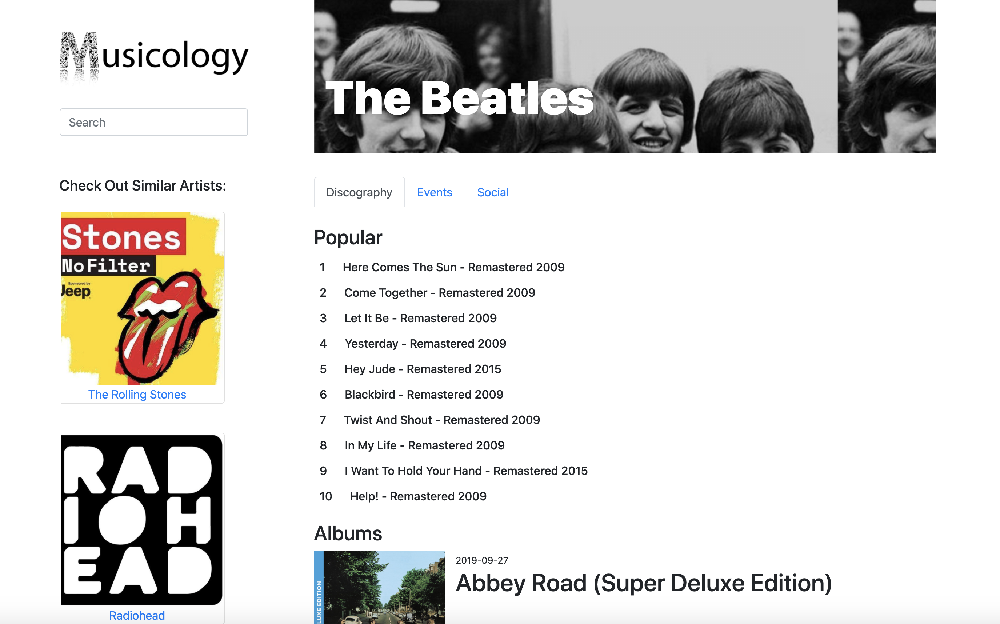
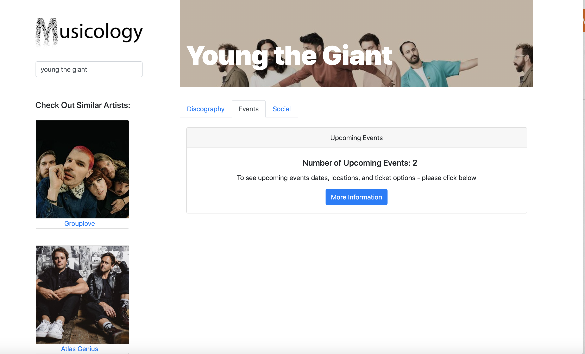
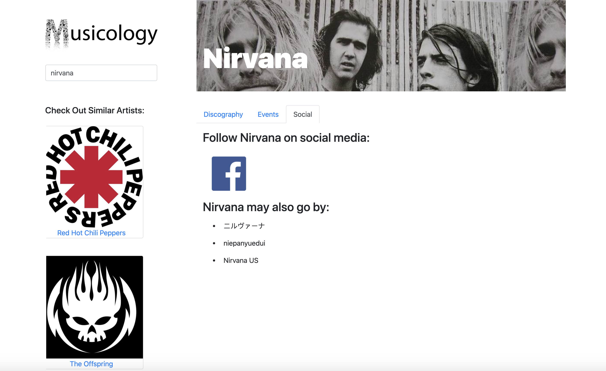
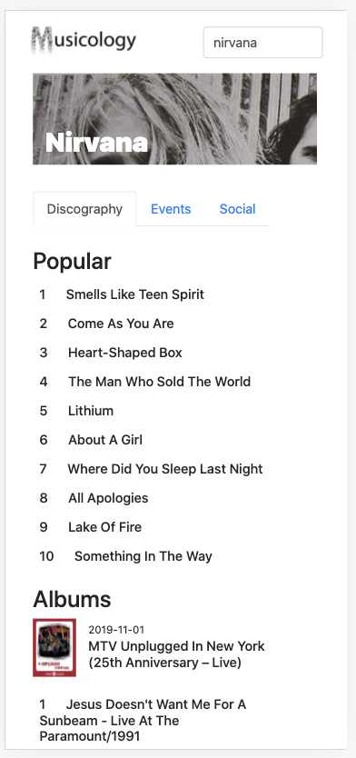

# Musicology READ.ME

## Description/Purpose

Musicology is a clean interface tool for music fans who want to easily review an artists’ discography, social media and upcoming events.  It is also a resource for those fans who are seeking new music by providing similar artist suggestions.

## Technologies Used

Languages used: 
- HTML
- CSS
- JAVASCRIPT / JQUERY

Wire-frame was constructed using Adobe XD

The site pulls information from the following server side APIs:
- Spotify 
   https://api.spotify.com/
- Taste Dive 
    https://cors-anywhere.heroku.com/https://tastedive.com/api/ 
- Bands in Town 
   https://rest.bandsintown.com/
- Musixmatch 
   https://developer.musixmatch.com/

The site also pulls from the following third-party APIs:
- JQuery
- Bootstrap with Popper.js
- Moment.js

## Features

Musicology presents the user with a clean and simple UI home page that features a search input that allows the user to type in the artist of their choice.  The search button will redirect the user to a search result page that will populate with information about the requested artist.

The search result page features another input for subsequent queries, as well as a sidebar of information on the left that will feature similar artists that are coded with clickable links to their information.  The middle of the page, and primary focus, will display the artist’s name and image.  Below the artist’s name are clickable tabs that will have discography, events and social media content specific to the requested artist.

## Functionality

For the user, the site is intentionally simple and easy to navigate.  
The UI is visually austere, and easily utilized, akin to google's design. 

The user can simply input an artist's name in order to get an output of their desired artist information.

On the search results page, there are three similar artist links that are clickable for additional information.  There are three clickable tabs that will provide discography, event and social media information.  The discography tab will feature the top 10 most popular songs in the U.S. and the artists' three most recent albums.  The events tab will populate with the number of upcoming events for that particular artist.  The social media links are clickable and will redirect to the artists' social media.  There is an additional search bar for subsequent searches.

## File Structure

The site is built with two html pages: index.html (home page) and results.html (search results page).  

index.html is linked to: 
-  style.css
-  script.js

results.html is linked to: 
-  resultsStyle.css 
-  spotify.js 
-  results.js

The html skeletons are fairly simple including search inputs, buttons, image links, a jumbotron and tabs with content divs.

## Examples/Screenshots

### Home Page

### Discography Tab

### Events Tab

### Social Tab

### Mobile Design

## Future Development

For future development:
- The events tab will feature an event calendar
- A user input page
- Dark/light mode
- A footer with an audio player
- Hide double album listings in discography 
